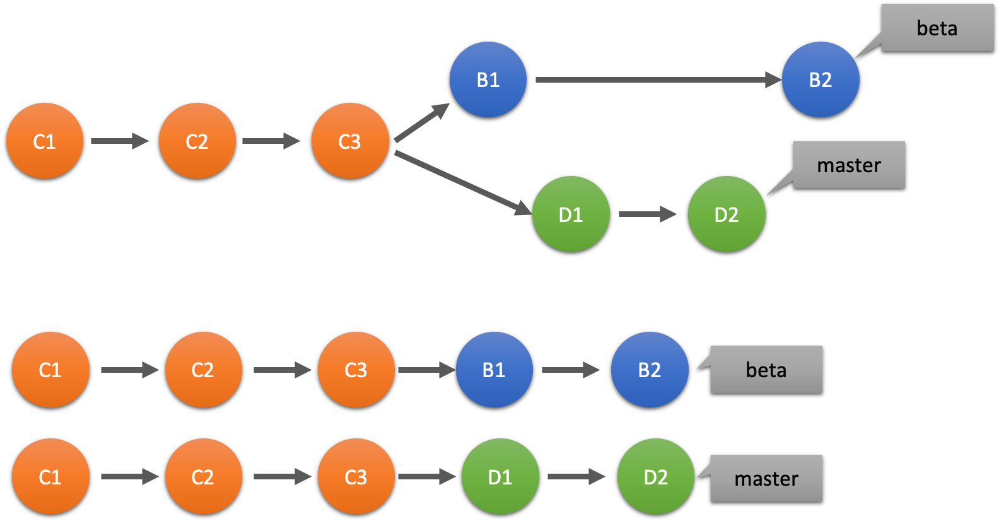
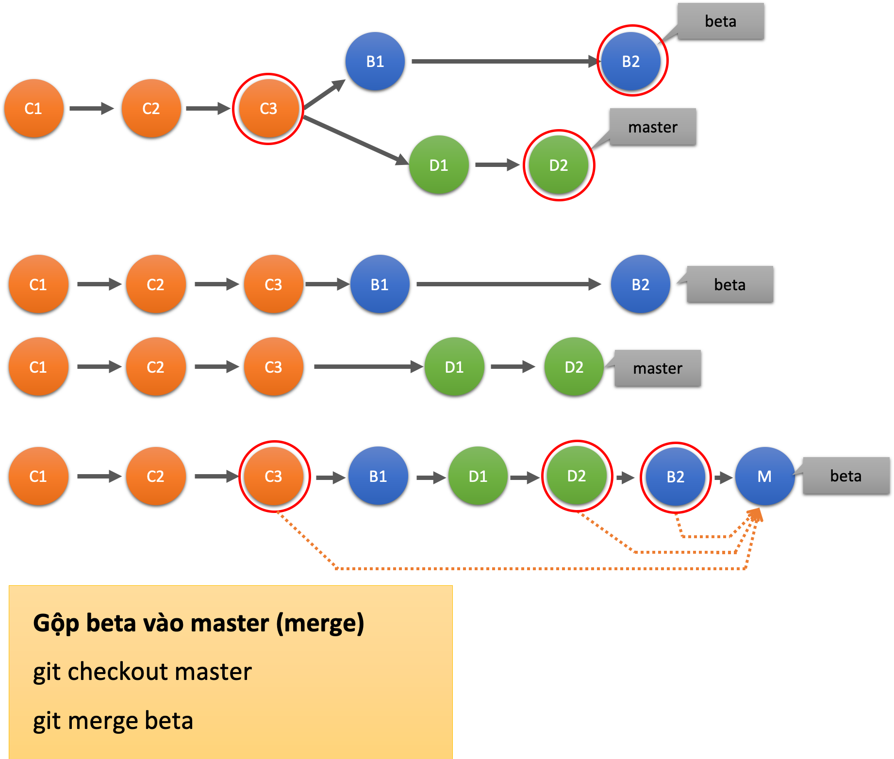

## Overview
### Git là gì?

Bạn đang làm việc cùng team ??? Thử tượng tượng rằng trong team bạn không ai biết gì về git cả và mỗi người code một phần, sau đó review và merge code thì ... **ÔI KINH HOÀNG**. Nào là code lỗi, code thiếu, không kịp update,... và Git trở thành vị cứu tinh.

- Git là một hệ thống quản lý phân tán (DVCS), giúp quản lý dự án đơn giản, dễ dàng hơn.  
- Các file có thể nằm trong 3 trạng sau của git: 
    * commited: Dữ liệu được lưu trữ an toàn trong Database 
    * modified: File có thay đổi nhưng chưa được lưu trong Database
    * staged: Đánh dấu các file sửa đổi **modified** để cho commit tiếp
- Git tổ  chức chia thành 3 khu vực:
    * Working tree
    * Staging
    * Git directory 

### Các trạng thái trong git 


* *Tracked*: là tập tin đã được đánh dấu theo dõi trong Git. Trong *Tracked* có các trạng thái phụ:
	+ Unmodified: Chưa chỉnh sửa 
	+ Modified: Đã chỉnh sửa nhưng chưa đưa vào *StagingArea*
	+ Staged: Đã đưa vào *StagingArea* và chuẩn bị commit 
* *Untracked*: các tập tin mới được tạo ra và chưa được đánh dấu theo dõi 

### Git Commit 

- `git commit` thực hiện lưu toàn bộ nội dung trong vùng Staging vào CSDL Git và *log* mô tả thay đổi so với commit trước 
	* `$ git commit -m "Add README"`
- Thêm -a sẽ thực hiện lệnh `git add` để đưa các file đang được giám sát có sự thay đổi vào staging rồi tự động chạy git commit
	* `$ git commit -a -m "Add README"`
- Amending: Sử dụng khi không muốn tạo nhiều commit bằng cách thêm tham số --amend
	```
		$ git commit -m "Add index.txt"
		$ git add ductn/index.txt
		$ git commit --amend 
	```

### Git reset

- Dùng lệnh `git reset` để  undo, hủy commit cuối hooawcj hủy đưa thay đổi vào vùng staging. 
- Khi đã thực hiện **commit** và chưa **push** thì có thể hủy commit đó theo 2 trường hợp: 
	* Thêm tham số  **--soft**, trường hợp này sẽ hủy commit cuối, con trỏ HEAD sẽ chuyển về commit cha, và những thay đổi của commit cuối được chuyển vào vùng **staging** để có thể commit lại hoặc sửa lại 
	`$ git reset --soft HEAD~1`
	* Thêm tham số **--hard** thì commit này sẽ không được đưa vào vùng **staging** mà sẽ bị hủy luôn
	`$ git reset --hard HEAD~1` 

### Git branch

- Tạo branch mới
	* `$ git branch ductn1`
- Thay đổi tên branch 
	* `$ git branch -m ductn1 ductn2`
- Chuyển branch 
	* `$ git checkout master`
- Merge branch 
	* `$ git merge ductn2`

### Git merge 

- Lệnh `git merge` dùng để  gộp các nhánh với nhau, sau khi gộp git sẽ tạo bản commit trên nhánh đấy và lịch sử commit không đổi.
- Giả sử  có 2 nhánh master và beta:

	

	* Để gộp các commit trong nhánh beta vào nhánh master thì chuyển làm việc trên master và thực hiện lệnh:
	`$ git merge beta`
	* Sau khi merger sẽ được kết quả

	  

### Git rebase 

- Lệnh `git rebase` cũng gộp commit từ nhánh này sang nhánh khác bằng cách xây lại các commit base kế thừa từ nhánh khác và viết lại lịch sử commit. 
- Để  viết lại lịch sử  của git sử dụng interactive rebase
	* `$ git rebase -i`
	* Chạy lệnh `git rebase -i` trên chính branch cần sửa nhưng lui về 1 ver bằng cách chỉ định `HEAD~1`
	`$ git rebase -i HEAD~1`
- Để  gộp các nhánh vào thực hiện lệnh
```bash
$ git checkout master
$ git rebase [branch]
```
- Git rebase khi remote có update mới
	* `$ git pull --rebase`

### Git Cherry-pick

- **Git Cherry-pick** là một cách để checkout một commit tại branch nhất định về branch hiện tại.
```bash
$ git checkout master
$ git cherry-pick other-commit
```
Lúc này nhánh **master** sẽ áp dụng những thay đổi trong **other-commit** về **master** 

### Git remote

- Quản lý các liên kết tới remote repo. Lệnh `git remote` cho phép tạo, xem và xóa kết nối giữa các Repo.
- Để liệt kê các liên kết sử dụng
	* `$ git remote` và hiện thị thông tin chi tiết hơn, có thêm đường dẫn đến remote Repo sử dụng `$ git remote -v`
- Tạo và xóa 1 liên kết
	* `$ git remote add remote-name url`
	* `$ git remote rm remote-name`
- Đổi tên remote
	* `$ git remote rename old-name new-name`
- Xóa các *remote branch* không được tham chiếu tới local
	* `$ git remote prune origin`

### Git Stash 

- Sử dụng khi muốn lưu lại những thay đổi *chưa commit*. Để lưu lại nội dung đang làm sử dụng lệnh: 
	* `$ git stash save ` or `$ git stash`
- Xem lại danh sách các stash đã lưu 
	* `$ git stash list`, xem lại cả nội dung `$ git stash list -p`
- Lấy lại thay đổi và xóa nội dung thay đổi lưu trong stash 
	+ ```
		$ git stash apply stash@{1}
	   	$ git stash drop stash@{1}
	  ```
	+ Hoặc sử dụng `$ git stash pop stash@{1}`
	+ Xóa toàn bộ `$ git stash clear`

### Tùy chọn force 

- Git `push --force` rất **nguy hiểm**, vì theo cơ chế  nó sẽ ghi đè lên remote repo bằng code ở local của mình, mà không cần quan tâm đến việc bên phía remote đang chứa thứ gì nên dễ làm mất code. Vì vậy, sử dụng `--force-with-lease` khi push sẽ giúp trong trường hợp cần force push code lên remote nhưng vẫn đảm bảo không mất code trước đó.

### [me](https://github.com/ductnn)